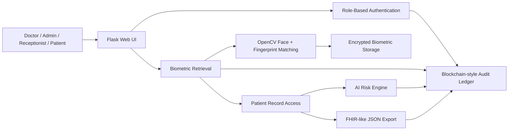
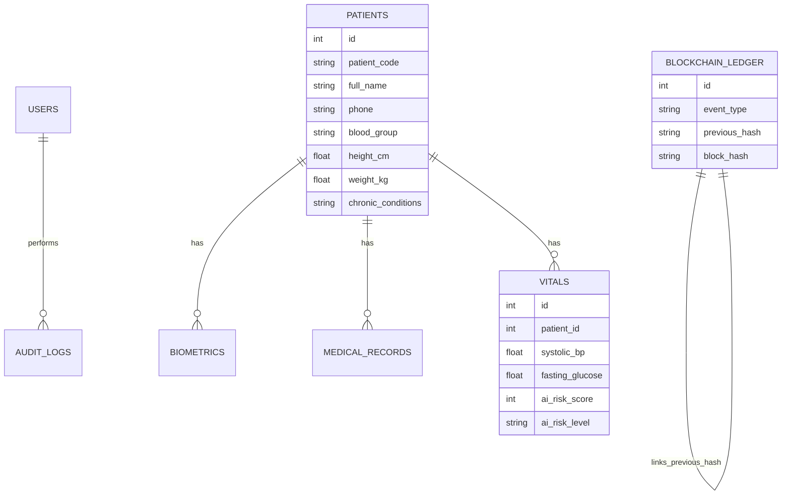

# Architecture

## High-Level Flow

## Main Modules

| Module | Responsibility |
| --- | --- |
| `app.py` | Flask routes, schema creation, login, RBAC, patient workflow, vitals, ledger, export |
| `biometric_engine.py` | Image decoding, OpenCV preprocessing, similarity scoring, encrypted file handling |
| `clinical_ai.py` | Explainable disease-risk scoring and recommendations |
| `templates/` | Web interface for dashboard, patients, retrieval, ledger, and reports |
| `static/css/style.css` | Responsive dashboard and clinical UI styling |
| `seed_demo_data.py` | Creates demo patient, biometric images, medical record, and AI vitals |

## Database Entities

## Security Layers

- Password hashing for login credentials.
- Role-based access control for admin, doctor, receptionist, and patient.
- Encrypted biometric file storage for demo-level privacy.
- Biometric session verification before patient self-access.
- SHA-256 hash-linked ledger for tamper-evident audit history.

## AI Layer

The AI layer is intentionally explainable for viva. It uses transparent clinical rules and gives:

- Risk score from `0` to `100`.
- Risk level: Low, Moderate, High, or Critical.
- Predicted disease focus areas.
- Findings that explain why the score was generated.
- Suggested follow-up action.

Inputs include BP, glucose, pulse, temperature, SpO2, BMI, symptoms, age, and latest diagnosis.
