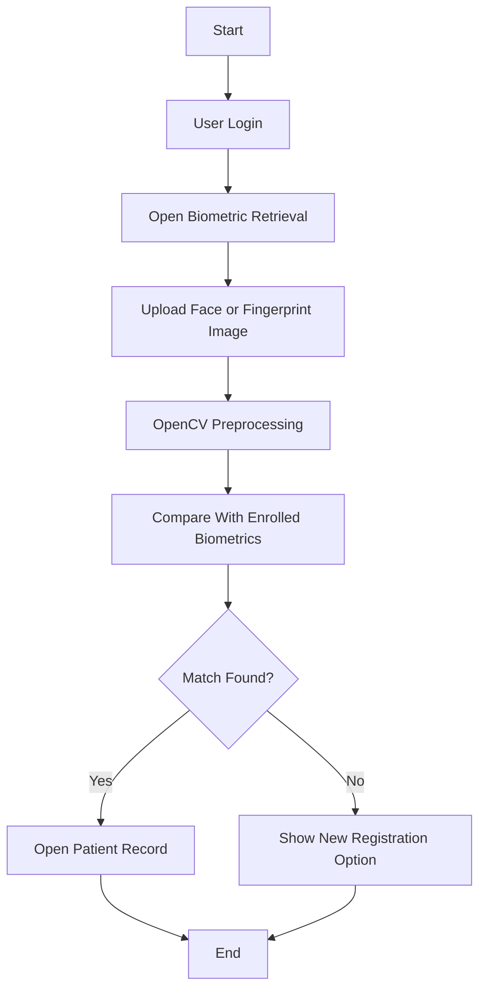
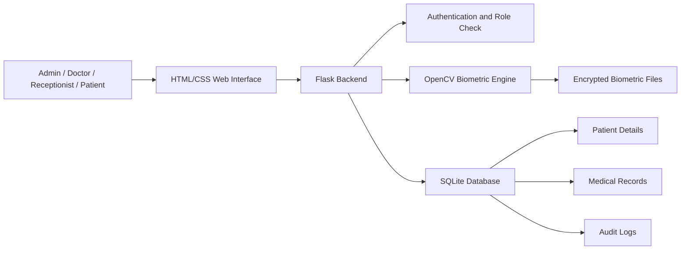
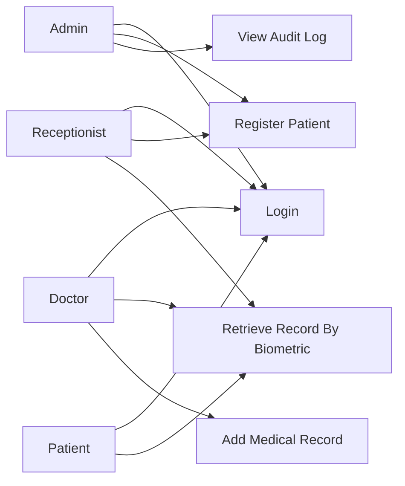
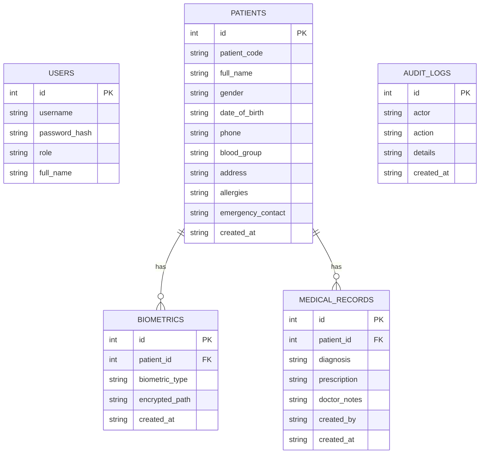

# Project Documentation

## Title

**AegisCare - AI Powered Biometric Healthcare Identity Platform**

## Abstract

AegisCare is a web-based MCA final-year project that retrieves patient medical records using multimodal face and fingerprint biometric verification. The system allows hospital staff to register patients, store biometric samples securely, retrieve records when a biometric sample matches an existing patient, generate AI-based patient risk summaries from vitals, and maintain a blockchain-style tamper-evident audit ledger. It uses Python Flask for backend development, HTML/CSS for frontend pages, SQLite for database storage, OpenCV for image processing, and an explainable AI layer for academic disease-risk prediction.

## Problem Statement

Hospitals often depend on patient ID cards, mobile numbers, or registration numbers to retrieve records. These identifiers can be forgotten, lost, or incorrectly entered. A biometric-based retrieval system helps identify registered patients quickly and reduces manual search errors.

## Objectives

- Register patients with basic demographic, contact, and medical details.
- Enroll face and fingerprint images for each patient.
- Encrypt biometric image files before storage.
- Retrieve records only when uploaded biometric data matches registered data.
- Generate AI patient risk using BP, sugar, pulse, SpO2, BMI, temperature, symptoms, and latest diagnosis.
- Maintain a blockchain-style hash ledger for tamper-evident audit events.
- Export patient data in a FHIR-like JSON format for interoperability demonstration.
- Provide role-based access for admin, doctor, receptionist, and patient demo user.
- Maintain an audit log of login, registration, retrieval, and record update actions.

## Proposed Platform

The recommended platform is a **web application**.

Reasons:

- Easy to run and demonstrate in a browser.
- Python OpenCV can run cleanly on the backend.
- HTML/CSS frontend is simple for academic explanation.
- SQLite avoids complex database setup.
- Flask code is smaller and easier to explain in viva.

## Technology Stack

| Layer | Technology |
| --- | --- |
| Frontend | HTML, CSS |
| Backend | Python Flask |
| Image Processing | OpenCV |
| AI Layer | Explainable rule-based risk prediction |
| Database | SQLite |
| Security | Role login, password hashing, demo encrypted biometric image files, hash-chain ledger |
| Interoperability | FHIR-like JSON export |
| Storage | Local encrypted biometric files |

## User Roles

| Role | Permissions |
| --- | --- |
| Admin | Full access, audit log, patient registration, record update |
| Doctor | View patients, biometric retrieval, add medical records |
| Receptionist | Register patients, view patients, biometric retrieval |
| Patient | Demo login and record retrieval flow |

## Main Modules

### 1. Authentication Module

Handles login, logout, role-based access control, and password hashing.

### 2. Patient Registration Module

Stores patient details such as name, date of birth, phone, blood group, address, allergies, and emergency contact.

### 3. Biometric Enrollment Module

Accepts face and fingerprint images, encrypts the image bytes with a demo standard-library encryption method, and stores the encrypted files locally. The database stores only file paths and metadata.

### 4. Biometric Matching Module

Uses OpenCV preprocessing, histogram comparison, ORB feature matching, and threshold-based decision logic to identify the best patient match.

### 5. Medical Record Module

Allows doctors and admins to add diagnosis, prescription, and notes.

### 6. AI Risk Prediction Module

Calculates patient risk level and disease focus areas from BP, glucose, pulse, temperature, SpO2, BMI, symptoms, age, and latest diagnosis. The output includes score, level, findings, predicted focus areas, and recommended action.

### 7. Blockchain Ledger Module

Converts important events into a hash-linked ledger. Each block stores event type, actor, payload, previous hash, block hash, and timestamp. The admin page verifies ledger integrity.

### 8. Interoperability Module

Provides a FHIR-like JSON bundle containing patient identity, latest AI observation, and clinical conditions so that the project can be explained as interoperable with external healthcare systems.

### 9. Audit Log Module

Stores important actions like login, registration, biometric match, and no-match attempts.

## Retrieval Flow

## System Architecture

## Use Case Diagram

## Database ER Diagram

## Algorithm

### Registration

1. User logs in as admin, doctor, or receptionist.
2. User enters patient details.
3. User uploads face and fingerprint images.
4. System encrypts biometric image bytes.
5. System stores patient details in SQLite and encrypted biometric files locally.

### Retrieval

1. User uploads face image, fingerprint image, or both.
2. System decrypts registered biometric images internally.
3. OpenCV converts images to grayscale and improves contrast.
4. Face image is cropped using Haar Cascade when possible.
5. ORB feature matching and histogram comparison calculate similarity.
6. If score is above threshold, patient record opens.
7. If score is below threshold, system shows new registration option.

## Security Notes

This project includes:

- Password hashing using Werkzeug.
- Role-based page access.
- Demo encrypted biometric image files using a random local key, SHA-256 based keystream, and HMAC verification.
- Audit logging.

For real hospital deployment, this would need stronger legal, privacy, biometric, and infrastructure controls.

## Future Enhancements

- Live webcam capture with face detection preview.
- Hardware fingerprint scanner integration.
- Better face recognition model such as FaceNet or DeepFace.
- Cloud database and backup.
- OTP verification for patient access.
- PDF medical report export.
- Advanced audit dashboard.

## Viva Questions

1. Why did you choose a web platform?
2. How does OpenCV help in this project?
3. What is biometric enrollment?
4. Why should raw biometric data be encrypted?
5. What happens when biometric matching fails?
6. What are the roles in your system?
7. Why did you use SQLite?
8. What is ORB feature matching?
9. How is this different from normal patient ID search?
10. What improvements are needed for real hospital deployment?
